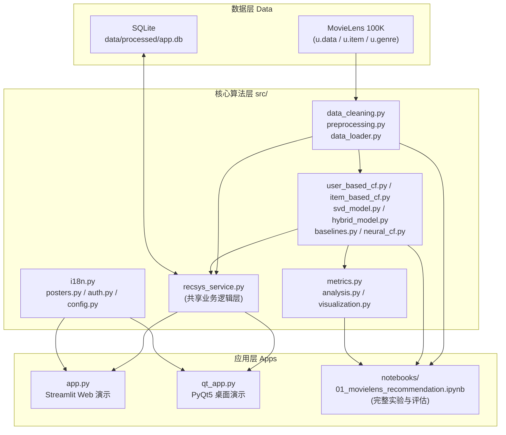
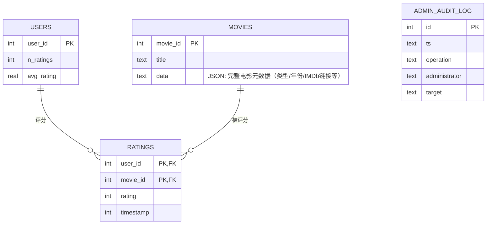

# FilmTrace · MovieLens 100K 推荐系统

面向高校数据挖掘课程的毕业设计 / 课程作业项目，基于 MovieLens 100K 数据集。项目覆盖完整的推荐系统链路：数据清洗与防泄漏的训练/验证/测试划分、多种推荐算法（协同过滤、矩阵分解、混合模型、神经网络）、排名与误差评估指标、诊断性分析，以及两套可交互演示应用（Streamlit Web 端与 PyQt5 桌面端），并配套 SQLite 持久化、单元测试与 CI。

> English summary: A university capstone project on the MovieLens 100K dataset covering data cleaning, leakage-aware splitting, collaborative filtering, matrix factorization, hybrid/neural models, ranking & error metrics, diagnostics, and two demo apps (Streamlit + PyQt5) backed by SQLite persistence, pytest, and GitHub Actions CI.

## 功能特性 / Features

- 基于用户的协同过滤 UserCF（余弦相似度 / Pearson 相关系数）
- 基于物品的协同过滤 ItemCF（余弦相似度 / Pearson 相关系数）
- 矩阵分解 SVD（`sklearn.decomposition.TruncatedSVD`，基于偏置基线残差）
- 基线模型：全局均值、用户均值、物品均值、正则化用户-物品偏置、随机评分、最受欢迎
- 元数据混合模型 Hybrid：结合用户统计、物品统计、类型、上映年份与交互特征的回归模型
- 可选的神经协同过滤模块 NeuralCF（`src/neural_cf.py`，需单独安装 PyTorch）
- 评分预测指标：RMSE、MAE
- Top-N 推荐指标：Precision@K、Recall@K、HitRate@K、NDCG@K、覆盖率
- 冷启动、数据稀疏性、用户活跃度、电影热度、类型维度的诊断分析
- K 折鲁棒性检验、学习曲线、偏置正则化调参、运行耗时与内存占用估算
- Top-N 推荐列表的多样性与新颖性诊断
- **Streamlit Web 演示**：首页（今日推荐/热门电影/系统能力展示）、为你推荐、电影库（含电影详情页）、管理员后台
- **PyQt5 桌面演示**：用户端与管理员端双入口，含图表、算法参数配置与评估面板
- SQLite 持久化层（`src/db.py`）：电影库管理、用户/评分快照、管理员操作审计日志
- pytest 测试套件与 GitHub Actions CI（ruff + pytest）

## 系统架构 / Architecture



- **数据层**：原始 MovieLens 100K 文件只读；管理员对电影库的增删改、用户/评分快照及操作审计写入本地 SQLite 数据库 `data/processed/app.db`。
- **核心算法层**：`src/` 包含数据清洗、特征工程、各推荐算法实现、评估指标与图表生成，被 notebook 与两个演示应用共同复用。
- **共享服务层**：`src/recsys_service.py` 封装"加载数据 → 计算推荐 → 写入数据库"等业务逻辑，避免在 Streamlit 与 PyQt5 中重复实现。
- **应用层**：`app.py`（Streamlit）与 `qt_app.py`（PyQt5）均通过共享服务层与核心算法层交互；`notebooks/` 用于完整实验、调参与评估报告生成。

## 数据库 ER 图 / Database Schema

`src/db.py` 中定义的 SQLite 持久化层（`data/processed/app.db`）：



- `movies`：电影库主数据表，管理员的"添加电影/编辑电影/删除电影"操作直接作用于此表（首次启动时由 `u.item` 自动播种）。
- `users` / `ratings`：用户与评分的快照表（首次启动由 `u.data` 自动播种），供管理员后台统计展示；大规模分析与建模仍直接读取 `src.data_loader` 提供的原始 CSV，以保证性能。
- `admin_audit_log`：记录每一次管理员的增删改操作（时间、操作类型、管理员、目标对象），用于后台"操作日志"展示。

## 项目结构 / Project Structure

```text
movielens_project/
|-- app.py                # Streamlit Web 演示（首页/为你推荐/电影库/管理员后台）
|-- qt_app.py              # PyQt5 桌面演示（用户端/管理员端）
|-- README.md
|-- requirements.txt
|-- environment.yml
|-- pyproject.toml
|-- .env.example           # 管理员账号、TMDb API Key 等环境变量模板
|-- data/
|   |-- raw/               # 解压后的 ml-100k 原始文件
|   `-- processed/         # app.db (SQLite) 等生成数据
|-- figures/                # notebook 生成的图表
|-- notebooks/
|   |-- 01_movielens_recommendation.ipynb
|   `-- 01_movielens_recommendation_executed.ipynb
|-- tests/                  # pytest 单元测试
|-- .github/workflows/ci.yml # GitHub Actions: ruff + pytest
`-- src/
    |-- analysis.py         # 诊断性分析（冷启动/稀疏性/类型/学习曲线等）
    |-- auth.py              # 管理员登录认证
    |-- baselines.py          # 基线模型（GlobalMean/UserMean/ItemMean/Bias/Random/MostPopular）
    |-- config.py             # 路径与超参数集中配置
    |-- data_cleaning.py      # 数据清洗
    |-- data_loader.py        # 原始数据加载
    |-- db.py                 # SQLite 持久化层（电影库/用户/评分/审计日志）
    |-- hybrid_model.py        # 元数据混合回归模型
    |-- i18n.py                # 中文界面文案与列名翻译
    |-- item_based_cf.py        # 基于物品的协同过滤
    |-- metrics.py              # RMSE/MAE/Precision/Recall/NDCG 等指标
    |-- neural_cf.py             # 可选的神经协同过滤（需 PyTorch）
    |-- posters.py               # 海报获取（TMDb API / 渐变占位图）
    |-- preprocessing.py          # 训练/验证/测试划分
    |-- recsys_service.py          # Streamlit 与 PyQt5 共享的业务服务层
    |-- similarity.py              # 相似度计算（余弦/Pearson）
    |-- svd_model.py                # SVD 矩阵分解
    |-- user_based_cf.py             # 基于用户的协同过滤
    `-- visualization.py             # 图表生成
```

## 截图 / Screenshots

> 答辩或展示前，建议自行运行 `streamlit run app.py` 与 `python qt_app.py`，将首页、为你推荐、电影详情页、管理员后台等关键界面截图保存到 `figures/screenshots/`，并在此处以 `` 的形式引用，便于答辩 PPT 与 GitHub 展示。

## Dataset Setup

Download MovieLens 100K from GroupLens and extract it so the files are placed here:

```text
data/raw/ml-100k/u.data
data/raw/ml-100k/u.item
data/raw/ml-100k/u.genre
```

The raw dataset is not committed to this repository.

## Environment Setup

Conda:

```bash
conda env create -f environment.yml
conda activate movielens-dm
```

Pip:

```bash
python -m venv .venv
.venv\Scripts\activate
pip install -r requirements.txt
```

PyTorch is not required for the main project. To run the optional neural CF experiment, install PyTorch separately and set `RUN_NCF = True` in the notebook.

## Running the Notebook

From the project root:

```bash
jupyter lab notebooks/01_movielens_recommendation.ipynb
```

The notebook can be verified from a clean kernel with:

```bash
jupyter nbconvert --to notebook --execute notebooks/01_movielens_recommendation.ipynb --output 01_movielens_recommendation_executed.ipynb --output-dir notebooks
```

The main experiment uses a **per-user temporal split**: each user's earlier ratings are used for training and later ratings are held out for testing. This avoids random row leakage while keeping collaborative-filtering evaluation focused on users with observed history. A global chronological split and a random split are included only as reference checks.

On the current Windows/Anaconda test environment, full notebook execution takes about **11-15 minutes**. Expensive robustness checks use deterministic samples, while the main model-comparison metrics still use the full held-out test set.

## Configuration (.env)

Copy `.env.example` to `.env` and adjust values locally (`.env` is gitignored):

```text
ADMIN_USERNAME=admin
ADMIN_PASSWORD=admin123

# Optional: enables real movie poster artwork via The Movie Database (TMDb).
# Get a free API key at https://www.themoviedb.org/settings/api
# If unset, the apps fall back to gradient placeholder posters.
TMDB_API_KEY=
```

If `.env` is absent, the apps use the default demo admin credentials (`admin` / `admin123`) and gradient poster placeholders.

## Running the Streamlit Demo

```bash
streamlit run app.py
```

中文导航：**首页**（数据集概览、今日推荐、热门电影、推荐结果预览、系统能力展示）→ **为你推荐**（可配置算法/Top-N/邻居数/隐因子数，生成个性化推荐卡片）→ **电影库**（搜索、电影详情页、评分记录、热门排行、数据可视化、相似电影）→ **管理员后台**（需登录，提供数据集管理、算法配置、模型评估、系统统计、操作审计）。

The app loads and cleans MovieLens 100K, computes recommendations with UserCF/ItemCF/SVD/Hybrid, and renders them as poster cards alongside a movie detail page, popularity rankings, and visualizations. The admin module additionally provides catalog CRUD, algorithm configuration, MAE/RMSE evaluation, and an audit log — all backed by the SQLite layer in `src/db.py`.

## Running the Qt Desktop System

The project also includes a PyQt5 desktop interface with separate user and administrator entrances:

```bash
python qt_app.py
```

If you use a Conda environment, activate it first (`conda activate movielens-dm`) and then run the same command from that environment's Python interpreter.

Administrator demo login:

```text
username: admin
password: admin123
```

These are the default credentials and can be overridden via `.env` (see above), with `ADMIN_USERNAME` and `ADMIN_PASSWORD`.

The Qt system reuses the same MovieLens backend modules (`src/`) as the notebook and Streamlit app via `src/recsys_service.py`. It provides user selection, personalized Top-N recommendation, movie search, rating history, popular movie ranking, charts, admin dataset dashboard, movie/user/rating management views, algorithm parameter controls, MAE/RMSE evaluation, and system statistics — all in Simplified Chinese.

## Running the Tests / CI

```bash
pytest -q
ruff check .
```

Both checks run automatically on every push via `.github/workflows/ci.yml`.

## Key Results Snapshot

These values come from the executed notebook using the cleaned per-user temporal split. Because the notebook is executable, treat it as the source of truth if future reruns produce slightly different timing values.

| Metric | Best Model / Setting | Value |
|--------|----------------------|-------|
| RMSE | SVD (bias-residual TruncatedSVD) | 0.9826 |
| MAE | SVD (bias-residual TruncatedSVD) | 0.7763 |
| Precision@10 | Most Popular / GlobalMean / UserMean | 0.0684 |
| Recall@10 | Most Popular / GlobalMean / UserMean | 0.0752 |
| NDCG@10 | Most Popular / GlobalMean / UserMean | 0.0908 |
| Catalog Coverage | Random baseline | 0.3014 |
| Best non-random coverage | User-Based CF | 0.0916 |
| Main relevance threshold | Actual held-out rating >= 4.0 | chosen positive-feedback cutoff |
| Top-N users evaluated | Held-out users sampled for ranking | 60 |
| Bias regularization | `reg = 1.0` | best tested value |
| Matrix sparsity | MovieLens 100K user-item matrix | 93.7% missing |
| Notebook runtime | Full executed notebook | about 11-15 minutes |

## Top-N Threshold Sensitivity

The main analysis uses `rating >= 4.0` as the relevance threshold because MovieLens ratings of 4 or 5 indicate clearly positive feedback. Lower thresholds are included as sensitivity checks because they make relevance more permissive.

| Threshold | Best Precision@10 | Best Recall@10 | Best NDCG@10 |
|-----------|-------------------|----------------|--------------|
| 3.0 | Most Popular / GlobalMean / UserMean, 0.0883 | Most Popular / GlobalMean / UserMean, 0.0691 | Most Popular / GlobalMean / UserMean, 0.1113 |
| 3.5 | Most Popular / GlobalMean / UserMean, 0.0684 | Most Popular / GlobalMean / UserMean, 0.0752 | Most Popular / GlobalMean / UserMean, 0.0908 |
| 4.0 | Most Popular / GlobalMean / UserMean, 0.0684 | Most Popular / GlobalMean / UserMean, 0.0752 | Most Popular / GlobalMean / UserMean, 0.0908 |

## Verification Checklist for Executed Notebook

After running:

```bash
jupyter nbconvert --to notebook --execute notebooks/01_movielens_recommendation.ipynb --output 01_movielens_recommendation_executed.ipynb --output-dir notebooks
```

verify that the executed notebook contains:

- [x] Final Decision Table with RMSE, MAE, Top-N metrics, coverage, timing, and memory
- [x] Threshold Sensitivity Analysis for relevance thresholds 3.0, 3.5, and 4.0
- [x] Paired statistical tests with p-values
- [x] Bootstrap RMSE confidence intervals
- [x] Cold-start penalty by activity/popularity tiers
- [x] Per-genre RMSE/MAE breakdown
- [x] Diversity and novelty metrics
- [x] Learning curves
- [x] Hyperparameter sensitivity plots for CF, SVD, and bias regularization
- [x] Memory footprint estimates
- [x] Best bias regularization value
- [x] Top-N evaluation details, including evaluated users and held-out ratings per user

All sections verified in `notebooks/01_movielens_recommendation_executed.ipynb`.

## Methodology Notes

### Data Split

The main experiment uses a **per-user temporal split**. For each user, earlier ratings are used for training and later ratings are held out for testing. This avoids random row leakage while ensuring every evaluated user has training history. A global chronological split and a random split are included only as references.

### Rating Prediction Metrics

RMSE and MAE are computed only on the held-out test ratings. All similarity matrices, user/item means, bias terms, hybrid features, and SVD factors are fit on the training split only.

### Top-N Recommendation Metrics

Top-N metrics convert explicit 1-5 ratings into binary relevance labels. The main notebook uses:

```text
relevant item = held-out actual rating >= 4.0
```

This threshold is stated explicitly because it changes Precision@K, Recall@K, HitRate@K, and NDCG@K. The notebook also reports sensitivity for thresholds 3.0, 3.5, and 4.0.

The offline Top-N setup evaluates recommendations against each user's held-out rated movies. Unrated catalog items are not observed negatives in the original data; they are simply unknown. In a full-catalog ranking evaluation, every unseen movie competes for the top 10, but only a small number of held-out ratings can count as positives. This makes Precision@10 and Recall@10 numerically low and makes the results sensitive to the relevance threshold and the number of held-out ratings per user. The notebook reports those counts so the ranking metrics are interpreted as an offline diagnostic, not as an online engagement estimate.

The notebook reports the number of held-out ratings per evaluated user, includes Random and Most Popular baselines, compares catalog coverage, and plots recommendation-frequency distribution. Diversity is measured by genre spread in the top-N list, and novelty is measured with popularity-based self-information. Per-model catalog coverage is part of the final decision table; this is where the popularity-bias trade-off is most visible, because Most Popular concentrates recommendations while broader models cover more of the catalog.

### Models Compared

1. Global mean baseline
2. User mean baseline
3. Item mean baseline
4. Regularized user-item bias baseline
5. Random rating baseline
6. User-based collaborative filtering
7. Item-based collaborative filtering
8. TruncatedSVD matrix factorization
9. Metadata hybrid regression

Most Popular and Random recommenders are included in the top-N evaluation because they are important ranking baselines, but they are not meaningful rating-prediction models.

### Result Interpretation

The corrected notebook result shows that the bias-residual TruncatedSVD model is the best RMSE model, while Most Popular, GlobalMean, and UserMean are strongest on the current full-catalog Recall@10/NDCG@10 setup because popularity tie-breaking gives them the same top-ranked candidates. This should be read as a warning sign, not just as a harmless trade-off. It suggests that the personalized rankers are not extracting enough ranking signal under this offline protocol. Likely contributors are the strict `rating >= 4.0` relevance threshold, small per-user held-out sets, full-catalog candidate ranking, and MovieLens 100K sparsity.

The reported 93.7% matrix sparsity matters operationally: user-user and item-item CF have limited overlap to estimate reliable neighborhoods, so weak Top-N performance is expected unless the candidate generation and ranking stages are tuned more carefully. A stronger production-style system would usually combine popularity priors, bias terms, latent factors, and re-ranking rather than relying on pure nearest-neighbor CF.

Cold-start robustness is reported with fixed activity tiers, not just one aggregate cold/warm split. Genre analysis reports per-genre RMSE/MAE and plots genre-level error. Error analysis includes prediction bias by actual rating, bootstrap RMSE confidence intervals, and paired tests against the bias baseline.

Hyperparameter analysis includes:

- UserCF and ItemCF `K_NEIGHBORS` over 5-50
- SVD `n_components`
- Bias-baseline regularization strength
- lightweight K-fold robustness checks for fast models
- learning curves for fast baselines
- fit/predict timing and approximate dense memory footprint

### Reproducibility

- Random processes use `random_state=42` where applicable.
- Predictions are clipped to the MovieLens 1-5 rating scale.
- The notebook prints package versions and expected runtime.
- The executed notebook artifact is included for verification.
- The SVD model is a lightweight `TruncatedSVD` factorization over residuals from the regularized bias baseline. It is stronger than raw or user-mean-only sparse SVD, but it is still not equivalent to a fully optimized biased matrix-factorization model trained with ALS or SGD.

## Limitations

- MovieLens 100K is small and old, so results should not be overgeneralized.
- Top-N evaluation uses explicit ratings as implicit relevance signals. Unrated movies are unknown, not true negatives, so full-catalog offline ranking can depress Precision@10/Recall@10 and is not directly comparable to sampled-negative benchmarks.
- User/item cold start remains difficult for pure collaborative filtering.
- The Streamlit demo shows item similarity and a bias-model point prediction rather than a production recommender with online feedback. Its prediction range is based on observed residual quantiles and should be treated as an approximate uncertainty cue, not a formal personalized confidence interval.
- The user-based and item-based CF implementations compute dense similarity matrices, so they do not scale directly to very large catalogs.
- Offline ranking metrics depend on the chosen relevance threshold.
- No online A/B test, click logs, session context, or implicit feedback are available.
- The optional neural CF module is provided for extension but is not part of the required reproducible run.

## Citation

If you use the dataset, cite:

> F. Maxwell Harper and Joseph A. Konstan. 2015. The MovieLens Datasets: History and Context. ACM Transactions on Interactive Intelligent Systems (TiiS) 5, 4: 19:1-19:19.

## References

- Sarwar, B. et al. Item-based collaborative filtering recommendation algorithms. WWW 2001.
- Koren, Y. et al. Matrix factorization techniques for recommender systems. Computer 2009.
