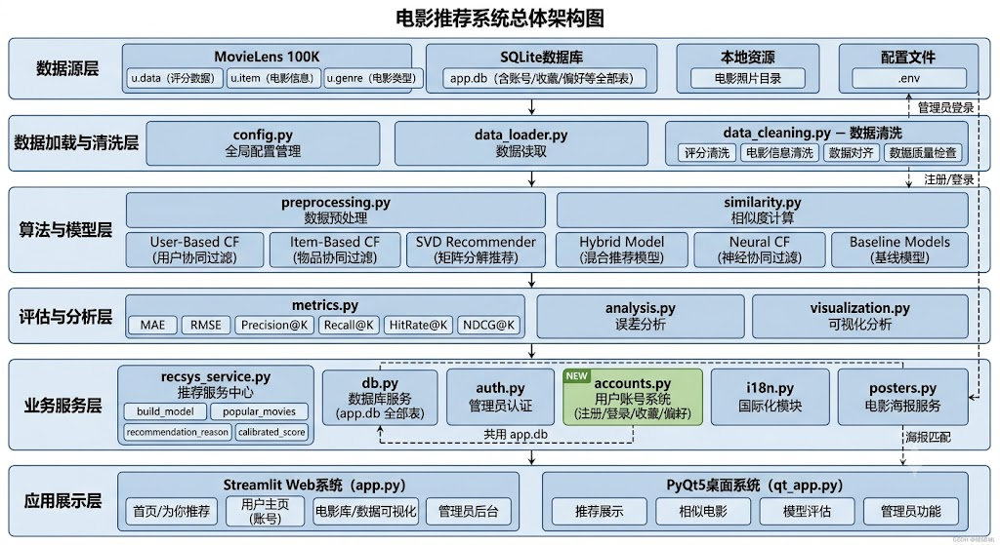
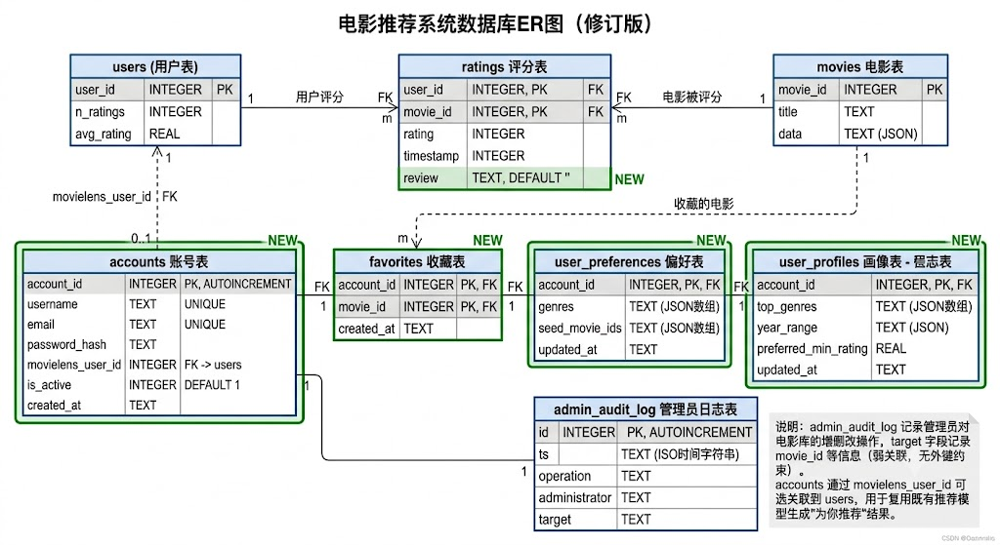

# FilmTrace MovieLens 100K Recommendation System

FilmTrace is a complete MovieLens 100K recommendation-system project built for a university data mining / machine learning course. It covers the full recommendation workflow: data cleaning, leakage-aware train/validation/test splitting, collaborative filtering, matrix factorization, hybrid and optional neural models, ranking and prediction metrics, diagnostic analysis, and interactive demonstrations through both Streamlit and PyQt5 interfaces.

The project is designed to show not only which movies are recommended, but also why they are recommended and how different algorithms perform.

## Features

- User-based Collaborative Filtering with cosine similarity and Pearson correlation
- Item-based Collaborative Filtering with cosine similarity and Pearson correlation
- SVD Matrix Factorization using `sklearn.decomposition.TruncatedSVD` on bias-baseline residuals
- Baseline models: global mean, user mean, item mean, regularized user-item bias, random rating, and most popular
- Metadata Hybrid model combining user statistics, item statistics, genres, release year, and interaction features
- Optional NeuralCF module in `src/neural_cf.py` with PyTorch
- Rating prediction metrics: RMSE and MAE
- Top-N ranking metrics: Precision@K, Recall@K, HitRate@K, NDCG@K, and catalog coverage
- Diagnostic analysis for cold start, matrix sparsity, user activity, movie popularity, and genre-level performance
- Robustness checks including K-fold evaluation, learning curves, bias regularization sensitivity, runtime, and memory estimates
- Diversity and novelty analysis for Top-N recommendation lists
- Streamlit web demo with landing page, personalized recommendations, movie catalog, movie detail pages, and admin dashboard
- PyQt5 desktop demo with user and administrator entrances, charts, algorithm controls, and evaluation panels
- SQLite persistence layer for movie management, user/rating snapshots, and administrator audit logs
- pytest test suite and GitHub Actions CI with ruff and pytest

## Architecture



- **Data layer:** The raw MovieLens 100K files are read-only. Admin movie edits, user/rating snapshots, and audit logs are stored in the local SQLite database `data/processed/app.db`.
- **Core algorithm layer:** The `src/` package contains data cleaning, preprocessing, feature engineering, recommendation models, evaluation metrics, and visualization helpers.
- **Shared service layer:** `src/recsys_service.py` wraps common application workflows such as loading data, generating recommendations, and writing records to the database.
- **Application layer:** `app.py` provides the Streamlit web app, `qt_app.py` provides the PyQt5 desktop app, and `notebooks/` contains the full experimental workflow.

## Database Schema

The SQLite persistence layer is defined in `src/db.py` and stored at `data/processed/app.db`.



- `movies`: main movie catalog table. Admin add/edit/delete operations are applied to this table after initial seeding from `u.item`.
- `users` / `ratings`: user and rating snapshot tables seeded from `u.data`; `ratings` also supports optional review text.
- `accounts` / `favorites` / `user_preferences` / `user_profiles`: FilmTrace account-system tables for registered users, favorites, genre preferences, and user profiles.
- `admin_audit_log`: audit trail for administrator operations, including timestamp, operation type, administrator, and target object.

## Project Structure

```text
movielens_project/
|-- app.py                 # Streamlit web demo
|-- qt_app.py               # PyQt5 desktop demo
|-- README.md
|-- requirements.txt
|-- environment.yml
|-- pyproject.toml
|-- .env.example            # admin credentials and optional TMDb API key template
|-- data/
|   |-- raw/                # extracted MovieLens 100K raw files
|   `-- processed/          # generated SQLite database and processed artifacts
|-- figures/                # notebook-generated figures and diagrams
|-- notebooks/
|   |-- 01_movielens_recommendation.ipynb
|   `-- 01_movielens_recommendation_executed.ipynb
|-- tests/                  # pytest tests
|-- .github/workflows/ci.yml
`-- src/
    |-- accounts.py          # user account and preference storage
    |-- analysis.py          # diagnostic analysis and Top-N evaluation helpers
    |-- auth.py              # administrator authentication
    |-- baselines.py         # baseline recommenders
    |-- config.py            # paths and hyperparameters
    |-- data_cleaning.py     # data validation and cleaning
    |-- data_loader.py       # raw MovieLens file loading
    |-- db.py                # SQLite persistence layer
    |-- hybrid_model.py      # metadata hybrid regression model
    |-- i18n.py              # UI language and display-label helpers
    |-- item_based_cf.py     # item-based collaborative filtering
    |-- metrics.py           # RMSE, MAE, Precision, Recall, NDCG, etc.
    |-- neural_cf.py         # optional neural collaborative filtering
    |-- posters.py           # TMDb poster lookup and local poster fallback
    |-- preprocessing.py     # train/validation/test splitting
    |-- recsys_service.py    # shared business service layer
    |-- similarity.py        # cosine and Pearson similarity
    |-- svd_model.py         # SVD matrix factorization
    |-- user_based_cf.py     # user-based collaborative filtering
    `-- visualization.py     # figure generation
```

## Screenshots

Before a presentation or demo, run the applications and save key screenshots such as:

- Streamlit landing page
- personalized recommendation page
- movie detail page
- admin dashboard
- model evaluation page
- PyQt5 desktop interface

Suggested location:

```text
figures/screenshots/
```

Then reference them in this README with standard Markdown image syntax, for example:

```markdown

```

## Dataset Setup

Download MovieLens 100K from GroupLens and extract it so the files are placed here:

```text
data/raw/ml-100k/u.data
data/raw/ml-100k/u.item
data/raw/ml-100k/u.genre
```

The raw MovieLens dataset is not committed to this repository.

## Environment Setup

Using Conda:

```bash
conda env create -f environment.yml
conda activate movielens-dm
```

Using pip:

```bash
python -m venv .venv
.venv\Scripts\activate
pip install -r requirements.txt
```

PyTorch is not required for the main project. To run the optional NeuralCF experiment, install PyTorch separately and set `RUN_NCF = True` in the notebook.

## Running the Notebook

From the project root:

```bash
jupyter lab notebooks/01_movielens_recommendation.ipynb
```

To execute the notebook from a clean kernel:

```bash
jupyter nbconvert --to notebook --execute notebooks/01_movielens_recommendation.ipynb --output 01_movielens_recommendation_executed.ipynb --output-dir notebooks
```

The main experiment uses a per-user temporal split: each user's earlier ratings are used for training and later ratings are held out for testing. This avoids random row leakage while keeping collaborative-filtering evaluation focused on users with observed history. A global chronological split and a random split are included as reference checks.

On the tested Windows/Anaconda environment, full notebook execution takes about 11-15 minutes. Expensive robustness checks use deterministic samples, while the main model-comparison metrics still use the full held-out test set.

## Configuration

Copy `.env.example` to `.env` and adjust values locally. The `.env` file is ignored by Git.

```text
ADMIN_USERNAME=admin
ADMIN_PASSWORD=admin123

# Optional: enables real movie poster artwork through The Movie Database (TMDb).
# Get a free API key at https://www.themoviedb.org/settings/api
# If unset, the apps fall back to local or generated placeholder posters.
TMDB_API_KEY=
```

If `.env` is absent, the apps use the default demo administrator credentials:

```text
username: admin
password: admin123
```

## Running the Streamlit Demo

```bash
streamlit run app.py
```

Main Streamlit sections:

- **Home:** landing page, featured movies, dataset overview, and system capability cards
- **For You:** configurable algorithm, Top-N recommendations, neighbor count, latent factors, and personalized recommendation cards
- **Movie Catalog:** movie search, movie details, ratings, popularity rankings, visual analytics, and similar movies
- **Admin Dashboard:** protected admin area with dataset management, algorithm configuration, model evaluation, system statistics, and audit logs

The app loads and cleans MovieLens 100K, computes recommendations with UserCF, ItemCF, SVD, Hybrid, and optional NeuralCF, and renders recommendations as movie cards. The admin module additionally provides catalog CRUD, algorithm configuration, MAE/RMSE evaluation, Top-N ranking metrics, and an audit log backed by SQLite.

## Running the Qt Desktop System

The project also includes a PyQt5 desktop interface with separate user and administrator entrances:

```bash
python qt_app.py
```

If you use Conda, activate the environment first:

```bash
conda activate movielens-dm
python qt_app.py
```

Default administrator login:

```text
username: admin
password: admin123
```

The Qt system reuses the same backend modules as the notebook and Streamlit app. It provides user selection, personalized Top-N recommendations, movie search, rating history, popular movie ranking, charts, admin dataset dashboard, movie/user/rating management views, algorithm parameter controls, MAE/RMSE evaluation, Top-N evaluation, and system statistics.

## Running Tests and CI

```bash
pytest -q
ruff check .
```

Both checks run automatically on every push through `.github/workflows/ci.yml`.

## Key Results Snapshot

These values come from the executed notebook using the cleaned per-user temporal split. Because the notebook is executable, treat it as the source of truth if future reruns produce slightly different timing values.

| Metric | Best Model / Setting | Value |
|--------|----------------------|-------|
| RMSE | SVD (bias-residual TruncatedSVD) | 0.9826 |
| MAE | SVD (bias-residual TruncatedSVD) | 0.7763 |
| Precision@10 | Most Popular / GlobalMean / UserMean | 0.0684 |
| Recall@10 | Most Popular / GlobalMean / UserMean | 0.0752 |
| NDCG@10 | Most Popular / GlobalMean / UserMean | 0.0908 |
| Catalog Coverage | Random baseline | 0.3014 |
| Best non-random coverage | User-Based CF | 0.0916 |
| Main relevance threshold | actual held-out rating >= 4.0 | positive-feedback cutoff |
| Top-N users evaluated | sampled held-out users | 60 |
| Bias regularization | `reg = 1.0` | best tested value |
| Matrix sparsity | MovieLens 100K user-item matrix | 93.7% missing |
| Notebook runtime | full executed notebook | about 11-15 minutes |

## Top-N Threshold Sensitivity

The main analysis uses `rating >= 4.0` as the relevance threshold because MovieLens ratings of 4 or 5 indicate clearly positive feedback. Lower thresholds are included as sensitivity checks because they make relevance more permissive.

| Threshold | Best Precision@10 | Best Recall@10 | Best NDCG@10 |
|-----------|-------------------|----------------|--------------|
| 3.0 | Most Popular / GlobalMean / UserMean, 0.0883 | Most Popular / GlobalMean / UserMean, 0.0691 | Most Popular / GlobalMean / UserMean, 0.1113 |
| 3.5 | Most Popular / GlobalMean / UserMean, 0.0684 | Most Popular / GlobalMean / UserMean, 0.0752 | Most Popular / GlobalMean / UserMean, 0.0908 |
| 4.0 | Most Popular / GlobalMean / UserMean, 0.0684 | Most Popular / GlobalMean / UserMean, 0.0752 | Most Popular / GlobalMean / UserMean, 0.0908 |

## Verification Checklist for the Executed Notebook

After running:

```bash
jupyter nbconvert --to notebook --execute notebooks/01_movielens_recommendation.ipynb --output 01_movielens_recommendation_executed.ipynb --output-dir notebooks
```

verify that the executed notebook contains:

- [x] final decision table with RMSE, MAE, Top-N metrics, coverage, timing, and memory
- [x] threshold sensitivity analysis for relevance thresholds 3.0, 3.5, and 4.0
- [x] paired statistical tests with p-values
- [x] bootstrap RMSE confidence intervals
- [x] cold-start penalty by activity and popularity tiers
- [x] per-genre RMSE/MAE breakdown
- [x] K-fold robustness checks
- [x] SVD factor sensitivity
- [x] CF neighbor-count sensitivity
- [x] diversity and novelty diagnostics

## Suggested GitHub Topics

```text
movielens
recommendation-system
recommender-system
collaborative-filtering
matrix-factorization
svd
python
pyqt5
streamlit
machine-learning
data-analysis
```

## License and Dataset Notice

This repository contains source code, notebooks, tests, figures, and application files. The raw MovieLens data files should be downloaded separately from GroupLens and placed under `data/raw/ml-100k/`.
